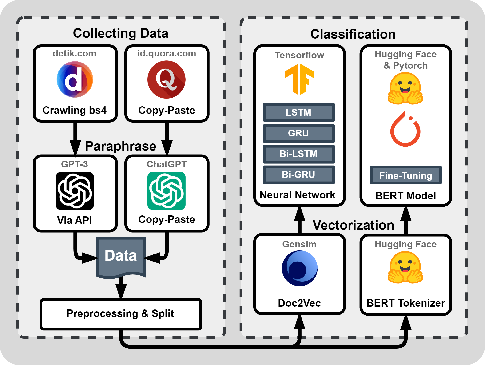

# AI Generated Text Detection with Deep Learning Approach on Indonesian Text


## Table of Contents
+ [About](#about)
+ [Tech Stack](#techstack)
+ [Getting Started](#getting_started)
+ [Usage](#usage)
+ [Reports](#reports)
+ [Screenshots](#screenshots)
+ [Author](#author)
+ [License](LICENSE)

## About <a name = "about"></a>

Artificial intelligence (AI) has become a popular technology that is now widely used by the public. That is due to the emergence of intelligent chatbots from OpenAI, namely ChatGPT. Various groups of people use ChatGPT for different purposes, one of them is students who use ChatGPT to understand material, do assignments, compose essays and paraphrase journals. Paraphrasing on ChatGPT and using paraphrased text as writing in papers can be considered a form of plagiarism. The problem is, to find out whether the text was AI-generated or human-written text, it takes a very long and in-depth understanding of the patterns and arrangement of words in the text. Therefore, we need a system that is able to detect text generated by AI or not. This text detection system uses a deep learning approach. Human text data is collected from the Detik news portal and the Quora question-and-answer website. AI text data is generated through a paraphrasing process on human text data. The vectorization in this research uses Doc2Vec and BERT Tokenizer. The models used in this study were LSTM, GRU, Bi-LSTM, Bi-GRU and BERT with the IndoBERT pre-trained model. Of the five models, the best accuracy on training data is BERT, while the best accuracy in evaluation with data validation is Bi-LSTM and Bi-GRU.

## Tech Stack <a name = "techstack"></a>

- Modeling: Numpy, Pandas, Scikit-learn, Gensim, Tensorflow, PyTorch, Hugging Face
- Web Application: Flask, JQuery, Tailwind CSS

## Getting Started <a name = "getting_started"></a>

These instructions will guide you through installing the project on your local machine for testing purposes. (Note: This project contains large file storage, so please be patient as processing may take several minutes)

### Requirements

This project requires Python 3.10.5.

### Installation (Linux or MacOS)

Clone this repository
```
git clone https://github.com/kevin-wijaya/AI-Generated-Text-Detection-with-Deep-Learning-Approach-on-Indonesian-Text.git
```
Rename the folder and change directory into it
```
mv AI-Generated-Text-Detection-with-Deep-Learning-Approach-on-Indonesian-Text ai-text-detection && cd ai-text-detection
```
Initialize the python environment to ensure isolation
```
python -m venv .venv
```
Install prerequisite python packages
```
python run.py pip install -r requirements.txt
```
Install the necessary LFS model
```
gdown --folder 19fi_oNv42G5n27bO-W1f03PDPYckjgPX -O ./models/ && git lfs install && git clone https://huggingface.co/indolem/indobert-base-uncased ./models/indolem/indobert-base-uncased
```
Run the python app.py using run.py and enjoy 😁
```
python run.py app
```

## Usage <a name = "usage"></a>

To use this web application is easy, follow these 3 steps:

1. **Insert Text**: Enter your text into the textarea provided.
2. **Detect**: Click on the "Detect" button to process the text and obtain results.
3. **Change Models**: Optionally, you can select different models from the options available to see varied results.

## Reports <a name = "reports"></a>

Below is a table showing the evaluation metrics from the experiments conducted:

### Evaluation Metrics Each Model
<table>
    <tr>
        <th>Model</th>
        <th>Precision (%)</th>
        <th>Recall (%)</th>
        <th>F1-Score (%)</th>
        <th>Accuracy (%)</th>
    </tr>
    <tr>
        <td>LSTM</td>
        <td>75</td>
        <td>75</td>
        <td>75</td>
        <td>75</td>
    </tr>
    <tr>
        <td>GRU</td>
        <td>71</td>
        <td>72</td>
        <td>71</td>
        <td>71</td>
    </tr>
    <tr>
        <td>Bi-LSTM</td>
        <td>77</td>
        <td>77</td>
        <td>77</td>
        <td>77</td>
    </tr>
    <tr>
        <td>Bi-GRU</td>
        <td>77</td>
        <td>77</td>
        <td>77</td>
        <td>77</td>
    </tr>
        <tr>
        <td>IndoBERT</td>
        <td>71</td>
        <td>71</td>
        <td>71</td>
        <td>71</td>
    </tr>
</table>

### Evaluation Metrics Each Label
<table>
    <tr>
        <th>Model</th>
        <th>Label</th>
        <th>Precision (%)</th>
        <th>Recall (%)</th>
        <th>F1-Score (%)</th>
    </tr>
    <tr>
        <td rowspan="2">LSTM</td>
        <td>Human</td>
        <td>72</td>
        <td>77</td>
        <td>75</td>
    </tr>
    <tr>
        <td>AI</td>
        <td>78</td>
        <td>74</td>
        <td>76</td>
    </tr>
        <tr>
        <td rowspan="2">GRU</td>
        <td>Human</td>
        <td>62</td>
        <td>77</td>
        <td>68</td>
    </tr>
    <tr>
        <td>AI</td>
        <td>81</td>
        <td>68</td>
        <td>77</td>
    </tr>
        <tr>
        <td rowspan="2">Bi-LSTM</td>
        <td>Human</td>
        <td>73</td>
        <td>79</td>
        <td>76</td>
    </tr>
    <tr>
        <td>AI</td>
        <td>80</td>
        <td>75</td>
        <td>78</td>
    </tr>
        <tr>
        <td rowspan="2">Bi-GRU</td>
        <td>Human</td>
        <td>72</td>
        <td>80</td>
        <td>76</td>
    </tr>
    <tr>
        <td>AI</td>
        <td>82</td>
        <td>74</td>
        <td>78</td>
    </tr>
        <tr>
        <td rowspan="2">IndoBERT</td>
        <td>Human</td>
        <td>67</td>
        <td>73</td>
        <td>70</td>
    </tr>
    <tr>
        <td>AI</td>
        <td>75</td>
        <td>69</td>
        <td>72</td>
    </tr>
</table>

## Screenshots <a name = "screenshots"></a>

Here are some screenshots of the application:


## Author <a name = "author"></a>
- **Kevin Wijaya** 